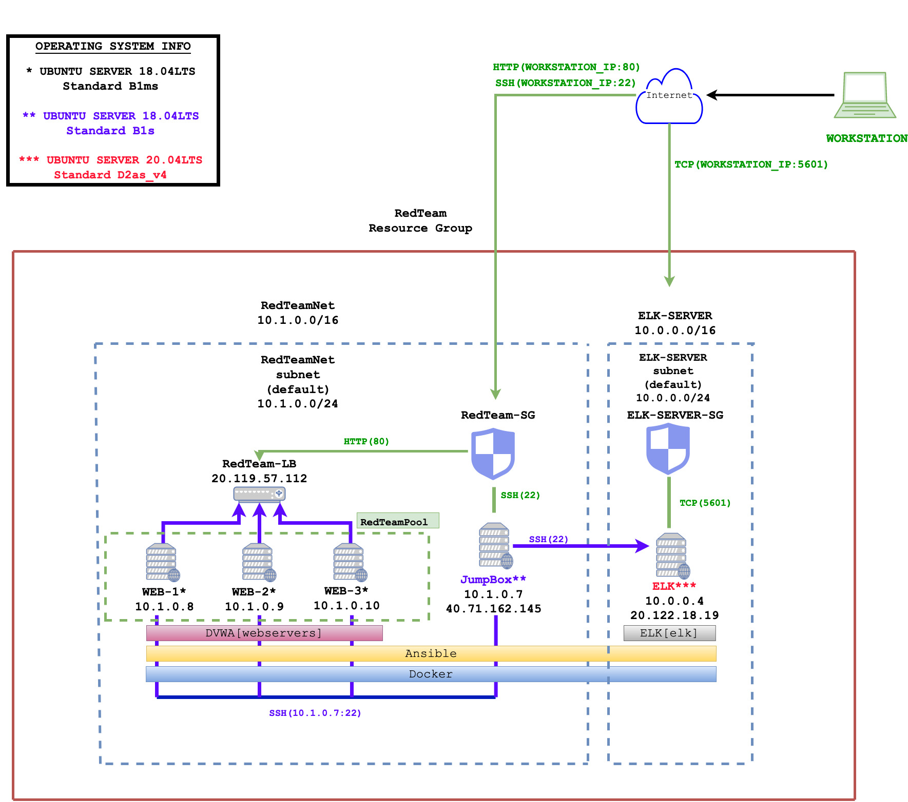

## Automated ELK Stack Deployment

The files in this repository were used to configure the network depicted below.

These files have been tested and used to generate a live ELK deployment on Azure. They can be used to either recreate the entire deployment pictured above. Alternatively, select portions of the **playbook file**  may be used to install only certain pieces of it, such as Filebeat.

  - _TODO: Enter the playbook file._

This document contains the following details:
- **Description of the Topology**
- **Access Policies**
- **ELK Configuration**
  - _Beats in Use_
  - _Machines Being Monitored_
- **How to Use the Ansible Build**

### Description of the Topology

The main purpose of this network is to expose a load-balanced and monitored instance of DVWA, the D*mn Vulnerable Web Application.

Load balancing ensures that the application will be highly available, in addition to restricting user access to the network.
- The **RedTeam-LB** protects the availability of the application by distributing client traffic among the WEB servers, which can detect and drop denial-of-service (DDoS) traffic. 
- The **JumpBox** machine provides an added layer protection by establishing a single public facing entry point to the network.

Integrating an ELK server allows users to easily monitor the vulnerable VMs for changes to the network and system configuration.
- **Filebeat** monitors the log files of the machines, collecting log events, and forwarding them to a centralized location, ELK-SERVER.
- **Metricbeat**  periodically collects metrics from the operating system and from services running on the machines in the network.

The configuration details of each machine may be found below.

| Name      | Function | IP Address | Operating System      |
|-----------|----------|------------|-----------------------|
| JumpBox   | Gateway  | 10.1.0.7   | UbuntuServer 18.04LTS |
| WEB-1     | WebServer| 10.1.0.8   | UbuntuServer 18.04LTS |
| WEB-2     | WebServer| 10.1.0.9   | UbuntuServer 18.04LTS |
| WEB-3     | WebServer| 10.1.0.10  | UbuntuServer 18.04LTS |
| ELK-SERVER| LogServer| 10.0.0.4   | UbuntuServer 20.04LTS |

### Access Policies

The machines on the internal network are not exposed to the public Internet. 

Only the **JumpBox** machine can accept connections from the Internet. Access to this machine is only allowed from the following IP addresses:
- **_WORKSTATION_IP_** _( The system administrator's public IP address )_  

Machines within the network can only be accessed by SSH connection via Port 22.

- **_WORKSTATION_IP_** is allowed a TCP connection through Port 5601 access to metric and log data of ELK-SERVER.
- **_JumpBox (10.1.0.7)_** is allowed SSH connection access to the WEB servers and the ELK-SERVER.

A summary of the access policies in place can be found in the table below.

| Name      | Publicly Accessible | Allowed IP Addresses    |
|---------- |---------------------|-------------------------|
| JumpBox   | Yes                 | WORKSTATION_IP          |
| ELK-SERVER| Yes                 | WORKSTATION_IP, 10.1.0.7|
| RedTeam-LB| Yes                 | WORKSTATION_IP          |
| WEB-1     | No                  | 10.1.0.7                |
| WEB-2     | No                  | 10.1.0.7                |
| WEB-3     | No                  | 10.1.0.7                |

### Elk Configuration

Ansible was used to automate configuration of the ELK machine, no configuration was performed manually. Ansible provides Infrastructure as code (IaC) which allows us to programmatically define the network and run code to manage, update and keep track of any changes. 

The playbook implements the following tasks:
- Install docker.io using ``apt``
- Install python3-pip using ``apt``
- Install docker Docker module using ``pip3``
- Increase and use more virtual memory using ``sysctl``
- Download and launch the docker elk container
- Enable docker on boot using ``systmd``

The following screenshot displays the result of running `docker ps` after successfully configuring the ELK instance.

### Target Machines & Beats
This ELK server is configured to monitor the following machines:
- WEB-1 ( 10.1.0.8 )
- WEB-2 ( 10.1.0.9 )
- WEB-3 ( 10.1.0.10 )

We have installed the following Beats on these machines:
- **Filebeat**
- **Metricbeat**

These Beats allow us to collect the following information from each machine:
- **Filebeat** monitors the log files of the machines, collecting log events, and forwarding them to a centralized location, ELK-SERVER. Such as ``log.file.path`` which lists the directory where logs are stored.
- **Metricbeat**  periodically collect metrics from the operating system and from services running on the **[webservers]** machines in the network. For example `host.os.name` which points to "Ubuntu" and ``process.name``. 

### Using the Playbook
In order to use the playbook, you will need to have an Ansible control node already configured. Assuming you have such a control node provisioned: 

SSH into the control node and follow the steps below:
- Copy the _____ file to _____.
- Update the _____ file to include...
- Run the playbook, and navigate to ____ to check that the installation worked as expected.

_TODO: Answer the following questions to fill in the blanks:_
- _Which file is the playbook? Where do you copy it?_
- _Which file do you update to make Ansible run the playbook on a specific machine? How do I specify which machine to install the ELK server on versus which to install Filebeat on?_
- _Which URL do you navigate to in order to check that the ELK server is running?

_As a **Bonus**, provide the specific commands the user will need to run to download the playbook, update the files, etc._